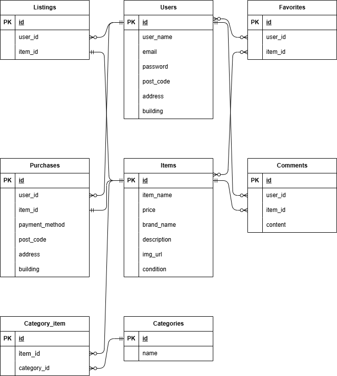

# coachtechフリマ

## プロジェクトの概要
coachtechフリマは、商品を出品・購入できるフリマアプリです。
ユーザーは会員登録を行い、商品検索、商品出品、購入、コメント、いいねなどの機能を利用できます。

## 環境構築
### GitHubリポジトリをクローン
git clone git@github.com:Estra-Coachtech/laravel-docker-template.git % ギットハブのURLは変える
git remote set-url origin 作成したリポジトリのurl
git add .
git commit -m "リモートリポジトリの変更"
git push origin main

### Docker起動
docker-compose up -d --build

### Laravelのインストール
docker-compose exec php bash
composer install

### .envファイル作成
cp .env.example .env

### .envファイルの設定
DB_CONNECTION=mysql
DB_HOST=mysql
DB_PORT=3306
DB_DATABASE=market_db
DB_USERNAME=market_user
DB_PASSWORD=market_pass

### アプリケーションキー作成
php artisan key:generate

### マイグレーション
php artisan migrate

### シーディング
php artisan db:seed

## 使用技術
- PHP 8.4
- Laravel 8.83
- MySQL 8.0
- Nginx 1.21
- Docker

## 機能一覧
- 会員登録
- ログイン
- ログアウト
- 商品一覧表示
- 商品詳細表示
- 商品検索機能
- 商品出品機能
- 商品購入機能
- コメント機能
- いいね機能
- マイページ
- プロフィール編集

## ER図

## URL
開発環境
http://localhost

phpMyAdmin
http://localhost:8080

## 作成者
松本沙織

## テストアカウント

メールアドレス: test@example.com
パスワード: password
